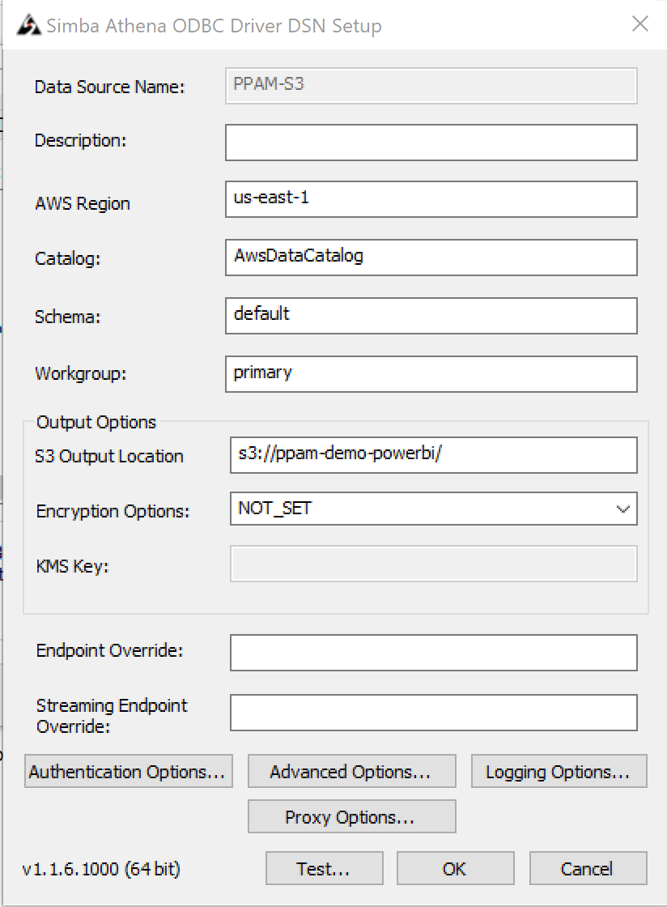

```{r setup, include=FALSE}
knitr::opts_chunk$set(echo = TRUE)
```

### Need Java 8 and Powershell installed and on path. Java 8 for Athena/ODBC handshake. Powershell for setting up Windows ODBC connection if GUI doesn't work


```{sh}

# Register the Microsoft RedHat repository
echo $LINUX_PASSWORD|sudo -S curl https://packages.microsoft.com/config/rhel/7/prod.repo | tee /etc/yum.repos.d/microsoft.repo

```

### Install PowerShell (Linux)

```{sh}

echo $LINUX_PASSWORD|sudo -S yum install -y powershell

```

### Powershell Version
```{sh}

# Start PowerShell
pwsh -version


```

### Only for PowerBI Setup Do We Need PowerShell Command to setup odbc DSN from command line




### When GUI doesn't work...
```{ps Powershell-AddODBC}

Add-OdbcDsn -Name "vhi000apcd" -DriverName "Simba Athena ODBC Driver" -DsnType "System" -Platform "64-bit" -SetPropertyValue @("S3OutputLocation=s3://athena-output-testing-pgx/", "AwsRegion=us-east-1", "AuthenticationType=Instance Profile")


```


```{r}

install.packages("rJava")
install.packages("RJDBC")

install.packages(c("plyr","dplyr","png","RgoogleMaps","ggmap"))

```

# Nice helper package for R/DBI handshake under the hood
```{r}

install.packages('AWR.Athena')

```


```{r}

library(rJava)
library(RJDBC)
library(plyr)
library(dplyr)
library(png)
library(RgoogleMaps)
library(ggmap)
library(AWR.Athena)

```


```{r}

#set up URL to download Athena JDBC driver
URL <- 'https://s3.amazonaws.com/athena-downloads/drivers/JDBC/SimbaAthenaJDBC-2.0.27.1001/AthenaJDBC42_2.0.27.1001.jar'

fil <- basename(URL)

```


```{r}

#download the file into current working directory
if (!file.exists(fil)) download.file(URL, fil)

#verify that the file has been downloaded successfully
fil
list.files()

```


```{r}

#set up driver connection to JDBC
drv <- JDBC(driverClass="com.simba.athena.jdbc.Driver", fil, identifier.quote="'")

```


```{r}

con <- jdbcConnection <- dbConnect(drv, 'jdbc:awsathena://athena.us-east-1.amazonaws.com:443/',
s3_staging_dir="s3://athena-output-testing-pgx/",
Schema='default',
user=Sys.getenv("ATHENA_USER"),
password=Sys.getenv("ATHENA_PASSWORD"))

dbListTables(con)

```


```{r}

# run a sample query
dfelb=dbGetQuery(con, "SELECT * FROM dnadixonrj")

dfelb


```

```{r}

con2 <- jdbcConnection <- dbConnect(drv, 'jdbc:awsathena://athena.us-east-1.amazonaws.com:443/',
s3_staging_dir="s3://athena-output-testing-pgx",
Schema='pgx-data-model',
user=Sys.getenv("ATHENA_USER"),
password=Sys.getenv("ATHENA_PASSWORD"))

dbListTables(con2)

```


```{r}

# run a sample query
dfelb2=dbGetQuery(con2, "SELECT * FROM dbhds_healthlake limit 10")

head(dfelb2,5)

```

